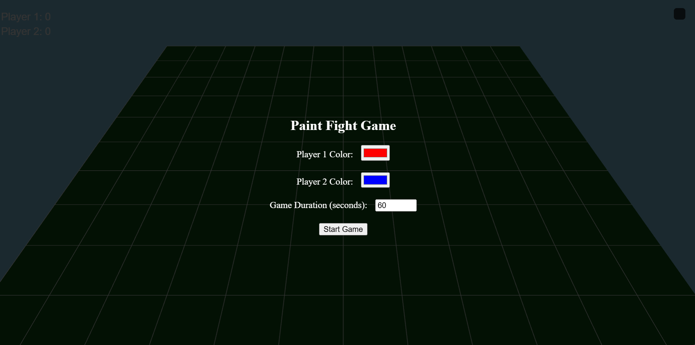
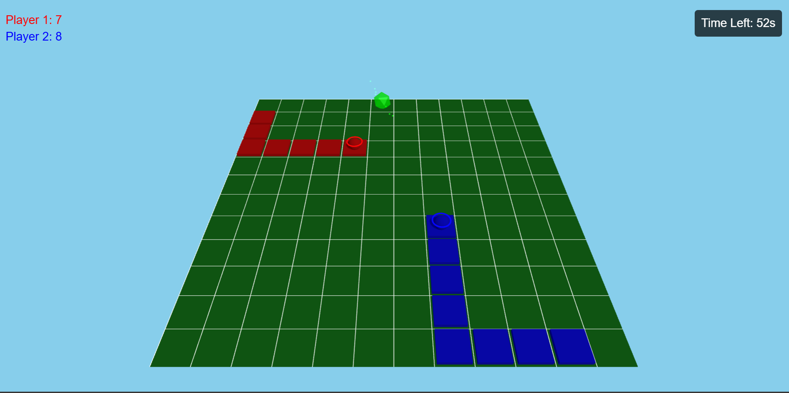
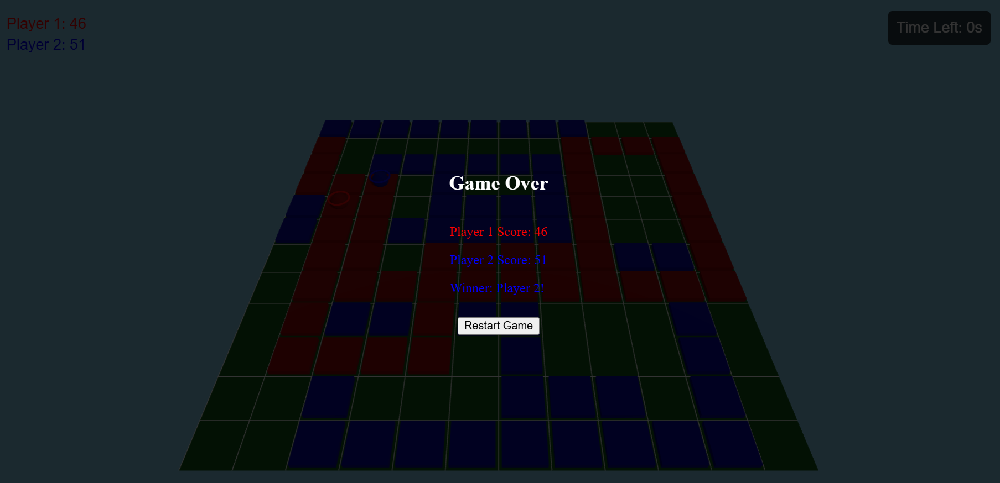

# Paint Fight Game

Welcome to **Paint Fight Game** – a fun, engaging two-player game where you compete to cover the most area with your paint! Each player uses different colored paint, and your mission is to conquer as much territory as possible before the timer runs out. Let the battle of colors begin!

## Table of Contents
- [About the Game](#about-the-game)
- [Features](#features)
- [Requirements](#requirements)
- [Setup and Installation](#setup-and-installation)
- [How to Play](#how-to-play)
- [Images](#images)

## About the Game
In Paint Fight Game, two players use different colors to mark cells on a virtual playing field. The game is all about strategy and quick moves – take control of cells by covering them with your paint. Collect power-ups along the way to gain temporary advantages over your opponent, such as increased speed or size.

## Features
- Two-player paint competition game.
- Unique power-ups to make gameplay more challenging and dynamic.
- Power-ups include speed boost and size increase.
- Real-time score tracking.
- Stunning visuals with Three.js and intuitive UI for great user experience.
- Background music to enhance the gaming experience.

## Requirements
This game is a JavaScript-based web application using **Three.js** for 3D graphics, **TWEEN.js** for animations, and background music to set the mood. Ensure you have the following:

- Node.js and npm (Node Package Manager) installed.
- A modern web browser (Chrome, Firefox, Safari).

You can find a list of dependencies in the [requirements.txt](./requirements.tx) file.

## Setup and Installation
The following instructions will guide you through downloading, setting up, and playing the game on your local machine. Don’t worry, you don’t need to be a tech expert to enjoy Paint Fight Game!

1. **Download the Game**
   - Click on the **Download** button/link provided.
   - Unzip the downloaded file to a folder on your computer.

2. **Install Node.js and npm**
   - If you don't have Node.js, download it from [https://nodejs.org/](https://nodejs.org/).
   - Install Node.js, which automatically includes npm (Node Package Manager).

3. **Install Dependencies**
   - Open a terminal (Command Prompt on Windows) and navigate to the folder where you unzipped the game files.
   - Run the following command to install all required dependencies:
     ```sh
     npm install
     ```

4. **Run the Game**
   - After the installation is complete, start the game server by running:
     ```sh
     npm start
     ```
   - Open a web browser and go to [http://localhost:3000](http://localhost:3000) to start playing!

## How to Play
1. **Select Colors and Game Duration**
   - On the start screen, choose your preferred colors for **Player 1** and **Player 2**.
   - Select the game duration from the available options (30, 45, 60, 90, 120 seconds).

2. **Start the Game**
   - Click on the **Start Game** button.

3. **Controls**
   - Player 1 uses **W, A, S, D** keys to move.
   - Player 2 uses **Arrow keys** to move.

4. **Objective**
   - The goal is to cover as much ground as possible with your color before the timer runs out.
   - Collect power-ups to gain an advantage over your opponent.

5. **Winning the Game**
   - The player with the highest score at the end of the time wins.

## Images
To get a feel of the game, here are some screenshots:

### Start Screen - Ready to Choose Your Colors and Battle!


### Gameplay in Action - Battle for Territory!


### Game Over - The Winner Takes It All!



